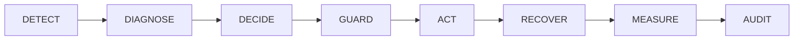
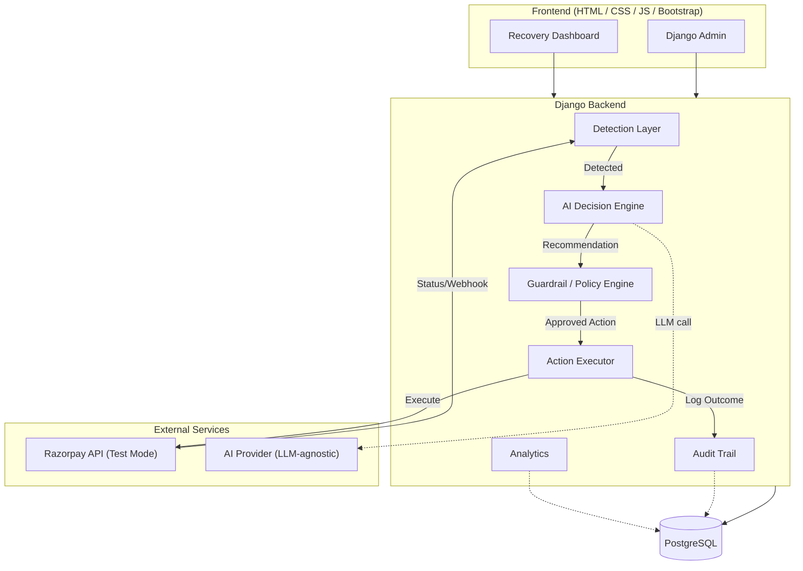

# AI Revenue Recovery Platform

> An AI-powered B2B revenue recovery platform that detects failed payments, diagnoses failure causes, recommends recovery interventions, enforces deterministic guardrails, executes bounded recovery actions, and measures actual recovered revenue — with a complete audit trail.

---

## The Problem

Businesses lose meaningful revenue every day to failed payments and lapsed subscriptions. A payment fails silently. No one investigates the cause. A blanket retry is fired. It fails again. The customer churns. The revenue is gone.

Manual intervention is slow, inconsistent, and doesn't scale. Generic retry logic ignores why a payment actually failed. There is no structured decision-making, no guardrails, and no measurement of what actually worked.

## The Solution

This platform introduces a structured, AI-assisted recovery workflow that treats every failed payment as a recoverable case. It:

- **Detects** payments at risk automatically
- **Diagnoses** the most likely failure cause from payment metadata and history
- **Decides** the most appropriate recovery intervention using an AI decision engine
- **Guards** every AI recommendation through a deterministic policy layer before any action is taken
- **Acts** within bounded, pre-authorised limits only
- **Measures** whether recovery was actually successful
- **Audits** every decision, action, and outcome

AI is a structured decision-making component inside a controlled workflow — not a chatbot, and never in direct control of money movement.

---

## How It Works



| Stage    | What happens |
|----------|-------------|
| DETECT   | Identify failed payments, lapsed subscriptions, pending charges |
| DIAGNOSE | Analyze failure reason, customer history, retry history, amount |
| DECIDE   | AI recommends the most appropriate recovery intervention |
| GUARD    | Deterministic policy engine validates or rejects the AI recommendation |
| ACT      | Only policy-approved actions are executed |
| RECOVER  | Payment outcome is tracked |
| MEASURE  | Revenue recovered is calculated from real records |
| AUDIT    | Complete decision/action/result trail is stored |

---

## Core Features (MVP)

- Payment and subscription failure detection
- AI-powered failure diagnosis
- AI recovery recommendation (retry / payment link / reminder / escalate / stop)
- Deterministic guardrail and policy validation layer
- Bounded action execution
- Recovery result tracking
- Revenue recovered calculation
- Recovery analytics dashboard
- Complete audit trail per recovery case
- Synthetic evaluation dataset and metrics
- Razorpay Test Mode integration

---

## Razorpay Buildathon Track

**Track 03 — AI Revenue Recovery**

This project is designed for the Razorpay AI Builder Internship / Buildathon 2026, Track 03. It demonstrates:

- Revenue risk detection
- Failure diagnosis
- Intervention selection
- Bounded recovery execution
- Actual recovery measurement
- Stopping rules
- Escalation handling
- Compliant audit trail

---

## Architecture Overview



**Critical principle:** AI recommends. The policy engine decides. The executor acts within pre-approved bounds only.

---

## Technology Stack

| Layer       | Technology                        |
|-------------|-----------------------------------|
| Frontend    | HTML, CSS, JavaScript, Bootstrap  |
| Backend     | Python, Django                    |
| Database    | PostgreSQL                        |
| Admin       | Django Admin + Jazzmin            |
| Payments    | Razorpay (Test Mode)              |
| AI          | LLM-agnostic (provider-replaceable) |

---

## Evaluation Approach

The platform is evaluated against a synthetic dataset of 100–500 payment/recovery records. All metrics are computed from actual records — no numbers are hardcoded.

Key metrics:
- Revenue at risk vs. revenue recovered
- Recovery rate
- AI intervention distribution
- Escalated / stopped / unresolved cases
- False-positive and incorrect-intervention analysis

See [`docs/EVALUATION.md`](docs/EVALUATION.md) for the full evaluation strategy.

---

## Security and Guardrail Philosophy

- AI **never** directly controls payment actions
- Every AI recommendation passes through a deterministic policy engine before execution
- Retry limits, recovery windows, and amount thresholds are enforced at the policy layer
- High-value cases require human approval
- All actions are idempotent and fully audited
- No secrets are committed to version control

See [`docs/SECURITY.md`](docs/SECURITY.md) and [`docs/GUARDRAILS.md`](docs/GUARDRAILS.md).

---

## Project Status

**Phase 0 — Foundation (current)**
Documentation, architecture, and folder structure are established. No application code exists yet.

See [`docs/ROADMAP.md`](docs/ROADMAP.md) for the full development plan.

---

## Development Setup

> Full setup instructions will be documented as the implementation progresses.
> See [`docs/DEVELOPMENT.md`](docs/DEVELOPMENT.md).

**Prerequisites (planned):**
- Python 3.11+
- PostgreSQL 15+
- A Razorpay Test Mode account

```bash
# TODO: commands will be added as implementation progresses
# See docs/DEVELOPMENT.md
```

---

## Repository Structure

```
.
├── README.md
├── .gitignore
├── .env.example
│
├── docs/                        # Project documentation
│   ├── PRODUCT.md
│   ├── ARCHITECTURE.md
│   ├── WORKFLOW.md
│   ├── AI_DECISION_ENGINE.md
│   ├── GUARDRAILS.md
│   ├── DATA_MODEL.md
│   ├── EVALUATION.md
│   ├── RAZORPAY_INTEGRATION.md
│   ├── SECURITY.md
│   ├── DEVELOPMENT.md
│   └── ROADMAP.md
│
├── config/                      # Django project configuration
│
├── apps/                        # Django application modules
│   ├── accounts/                # User auth and merchant accounts
│   ├── merchants/               # Merchant profile and settings
│   ├── customers/               # Customer records
│   ├── payments/                # Payment and subscription records
│   ├── recovery/                # Recovery cases, decisions, actions
│   ├── ai_engine/               # AI diagnosis and recommendation layer
│   ├── guardrails/              # Deterministic policy engine
│   ├── analytics/               # Recovery metrics and reporting
│   └── audit/                   # Audit trail
│
├── templates/                   # Django HTML templates
├── static/                      # CSS, JS, images
├── tests/                       # Test suite
├── scripts/                     # Management and utility scripts
└── fixtures/                    # Synthetic evaluation dataset
```

---

## Roadmap Summary

| Phase | Description |
|-------|-------------|
| 0     | Foundation — docs, structure (current) |
| 1–3   | Data model, payment ingestion, risk detection |
| 4–6   | AI diagnosis, recovery decisions, guardrails |
| 7–9   | Action execution, recovery measurement, audit |
| 10–11 | Evaluation, UI polish |
| 12    | Final Buildathon submission |

---

## Future Commercial Vision

The MVP targets failed payment and subscription recovery. A commercial product could expand to:

- Multi-provider payment gateway support
- Multi-channel customer communication (email, SMS, WhatsApp)
- Revenue forecasting and churn risk signals
- Custom recovery policies per merchant
- API-first platform with merchant SDK
- Compliance and regulatory audit reporting

These are deliberately out of scope for the MVP.

---

*Built for the Razorpay AI Builder Internship / Buildathon 2026 — Track 03: AI Revenue Recovery.*
