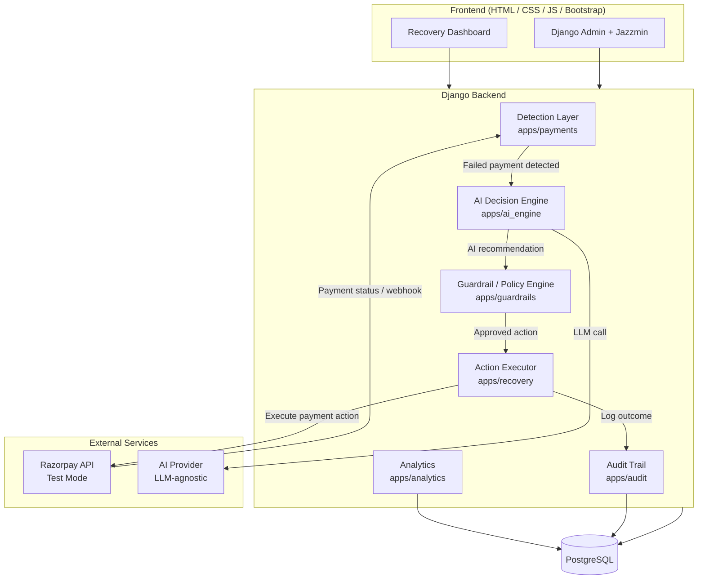

# Architecture — AI Revenue Recovery Platform

---

## Overview

The system is a Django monolith with clearly separated internal modules. Each module has a defined responsibility. The architecture avoids microservices at this stage while remaining modular enough to extract components later if needed.

The most important architectural principle is the separation between:

- **AI Decision Engine** — recommends what to do
- **Guardrail / Policy Engine** — validates whether it is allowed
- **Action Executor** — performs only what is authorised

These three layers must never be collapsed. The AI engine must not directly trigger actions. The executor must not act without guardrail approval.

---

## High-Level Architecture



---

## Component Responsibilities

### Frontend

**Technology:** HTML, CSS, JavaScript, Bootstrap

- Renders recovery case lists and case detail views
- Displays recovery analytics and metrics
- Provides basic case management UI
- Read-mostly: most workflow steps are backend-driven
- Django Admin (with Jazzmin) used for internal data management during development

---

### Django Backend

The backend is structured as a Django monolith with distinct internal applications (Django apps). Each app owns a specific domain.

#### `apps/accounts`
User authentication, session management, and role-based access. Merchants log in here.

#### `apps/merchants`
Merchant profiles, settings, and recovery policy configuration. Each merchant can have custom guardrail parameters within platform defaults.

#### `apps/customers`
Customer records associated with each merchant. Includes payment history signals used in diagnosis.

#### `apps/payments`
Payment records, subscription records, and failure events. This is the entry point for the recovery workflow. The detection layer lives here.

#### `apps/recovery`
Recovery cases, AI decisions, recovery actions, and recovery results. The core workflow state machine lives here.

#### `apps/ai_engine`
The AI diagnosis and recommendation layer. Constructs structured prompts, calls the configured LLM provider, parses and validates AI responses. Does not directly execute any actions.

#### `apps/guardrails`
The deterministic policy engine. Validates every AI recommendation against merchant-level and platform-level recovery policies. Acts as the authorization gate before any action is executed.

#### `apps/analytics`
Aggregate recovery metrics: revenue at risk, revenue recovered, recovery rate, intervention distribution. All metrics are computed from actual records.

#### `apps/audit`
Immutable audit log. Records every decision, action, and outcome with timestamps, actor identity, and relevant context.

---

### PostgreSQL Database

The primary data store for all application data. Key tables correspond to the entities described in [`DATA_MODEL.md`](DATA_MODEL.md). No caching layer is introduced at MVP stage.

---

### AI Decision Engine

The AI engine is **LLM-agnostic**. The provider (OpenAI, Anthropic, Google, etc.) is configured via environment variables and can be swapped without changing the core recovery workflow.

The engine:
- Accepts a structured input payload describing the payment failure context
- Returns a structured JSON response: recommended action, confidence, reasoning summary
- Does **not** execute actions
- Does **not** access the database directly during inference
- Fails gracefully: if the LLM call fails or returns an unparseable response, the system falls back to a safe configurable default

See [`AI_DECISION_ENGINE.md`](AI_DECISION_ENGINE.md) for full specification.

---

### Guardrail / Policy Engine

A fully deterministic layer that runs after every AI recommendation and before every action execution.

The policy engine:
- Checks retry limits per payment/subscription
- Checks recovery window expiry
- Prevents duplicate actions on the same case in the same time window
- Enforces amount thresholds
- Routes high-value or repeated-failure cases to human escalation
- Enforces stopping rules
- Returns an authorization decision: APPROVED, REJECTED, or ESCALATED

The AI engine cannot override the policy engine. Ever.

See [`GUARDRAILS.md`](GUARDRAILS.md) for the full policy specification.

---

### Action Executor

Executes only policy-approved actions. Current bounded action types:

| Action | Description |
|--------|-------------|
| `RETRY_PAYMENT` | Trigger a payment retry via Razorpay API |
| `SEND_PAYMENT_LINK` | Generate and send a Razorpay payment link |
| `SEND_REMINDER` | Send a payment reminder notification |
| `SCHEDULE_RETRY` | Schedule a retry at a future time |
| `ESCALATE_TO_HUMAN` | Flag the case for manual review |
| `STOP_RECOVERY` | Mark the case as stopped; cease further attempts |

Actions are **idempotent**: executing the same action twice on the same case produces the same result without duplicating external calls.

---

### Razorpay Integration

Razorpay is used exclusively in Test Mode during development and evaluation.

Integration points:
- Fetch payment and subscription records
- Retrieve payment failure details
- Trigger payment retries (where supported by API)
- Generate payment links
- Receive payment status webhooks

See [`RAZORPAY_INTEGRATION.md`](RAZORPAY_INTEGRATION.md) for the full integration plan.

---

### Recovery Result Tracking

After an action is executed, the system polls or receives a webhook to determine the outcome:

- **RECOVERED** — payment succeeded after intervention
- **FAILED** — payment failed again despite intervention
- **PENDING** — outcome not yet known
- **ESCALATED** — case handed to a human operator
- **STOPPED** — recovery ceased per stopping rules

---

### Audit System

Every step in the workflow is recorded:

- What was detected, when, and from what source
- What the AI diagnosed and recommended
- What the policy engine decided and why
- What action was executed, when, and by what actor
- What the result was
- Any errors or fallback decisions

The audit log is append-only. No audit record is modified after creation.

---

## Data Flow Summary

```
Payment failure event
        │
        ▼
Detection Layer (apps/payments)
  Creates PaymentFailure record
  Creates RecoveryCase record
        │
        ▼
AI Decision Engine (apps/ai_engine)
  Constructs structured prompt from case context
  Calls LLM provider
  Parses and validates structured response
  Stores AIAnalysis record
        │
        ▼
Guardrail / Policy Engine (apps/guardrails)
  Validates AI recommendation against policies
  Returns: APPROVED | REJECTED | ESCALATED
  Stores RecoveryDecision record
        │
     [APPROVED]
        │
        ▼
Action Executor (apps/recovery)
  Executes bounded action via Razorpay or notification
  Stores RecoveryAction record
        │
        ▼
Recovery Result Tracker
  Receives payment outcome (webhook or poll)
  Stores RecoveryResult record
        │
        ▼
Analytics (apps/analytics)
  Aggregates metrics from actual records
        │
        ▼
Audit Trail (apps/audit)
  Append-only log of all steps above
```

---

## Architectural Constraints

1. AI must not directly trigger Razorpay API calls.
2. The executor must not run without a guardrail-issued authorization.
3. All actions must be idempotent.
4. The AI provider is replaceable via configuration — the core workflow does not depend on a specific LLM.
5. No microservices at MVP stage.
6. PostgreSQL is the single source of truth — no external state.
