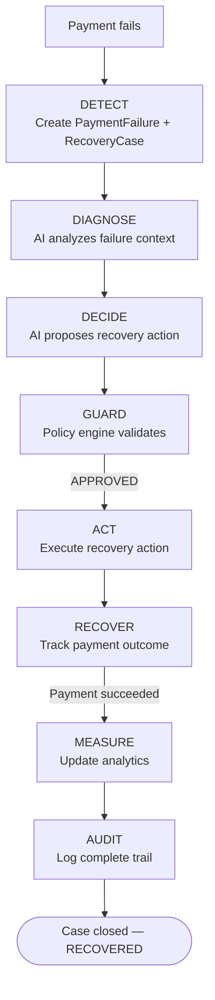
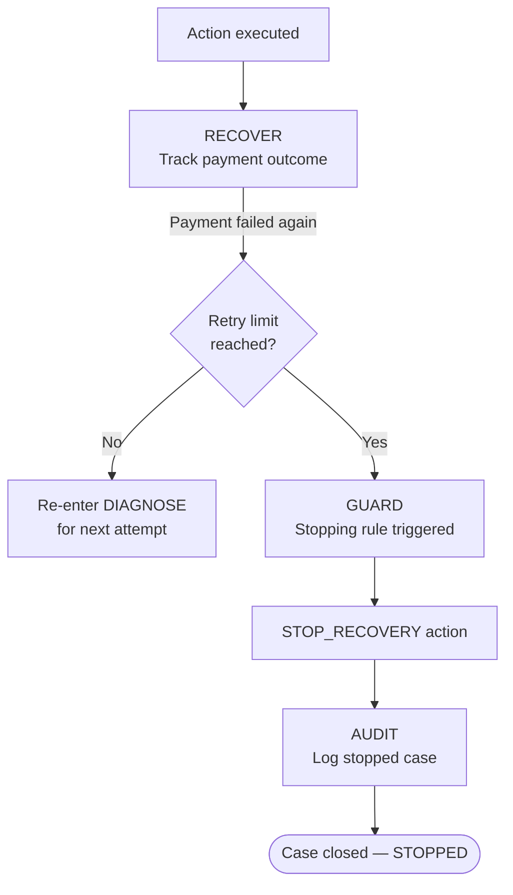
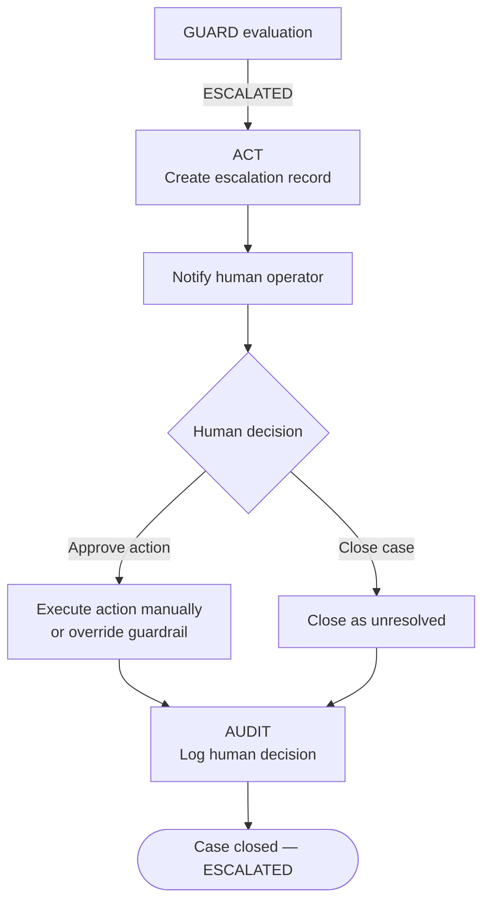
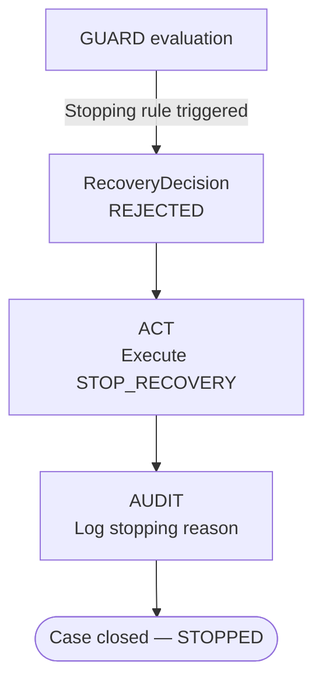
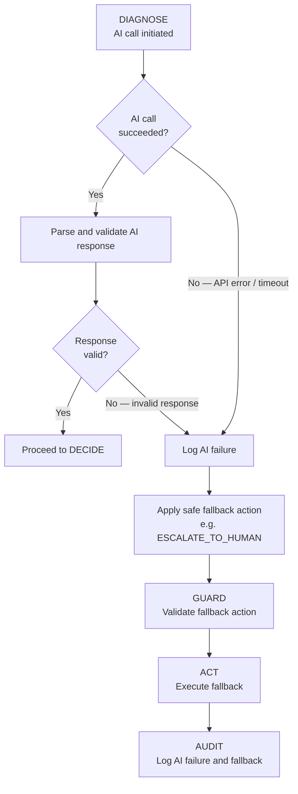

# Recovery Workflow — AI Revenue Recovery Platform

---

## Overview

The recovery workflow is the core operational loop of the platform. Every failed payment or lapsed subscription is processed through a structured sequence of eight stages:

```
DETECT → DIAGNOSE → DECIDE → GUARD → ACT → RECOVER → MEASURE → AUDIT
```

Each stage has a defined input, a defined output, and a defined failure mode. The stages are not optional — every recovery case passes through all of them, even if some transitions are immediate (e.g., a GUARD rejection moves directly to AUDIT without reaching ACT).

---

## Stage Definitions

### 1. DETECT

**Input:** Payment failure event, subscription status change, or scheduled detection scan  
**Output:** A new `RecoveryCase` record with status `DETECTED`

The detection layer identifies:
- Payments that have failed (status: `failed`)
- Subscriptions that have lapsed or failed to charge
- Payments that have been pending beyond an acceptable threshold
- Repeated failures on the same customer/merchant combination

Detection sources:
- Razorpay webhooks (payment failure events)
- Periodic polling of Razorpay payment/subscription APIs
- Manual ingestion (for evaluation and testing)

A `PaymentFailure` record is created capturing the raw failure data. A `RecoveryCase` is opened to track the full lifecycle. Duplicate detection prevents the same payment failure from opening multiple cases.

---

### 2. DIAGNOSE

**Input:** `RecoveryCase` with raw payment failure data  
**Output:** `AIAnalysis` record with structured diagnosis

The AI Decision Engine receives a structured context payload including:
- Payment failure reason code (e.g., `insufficient_funds`, `card_expired`, `bank_declined`)
- Payment amount
- Customer payment history (previous failures, previous successful payments)
- Subscription status (active, paused, cancelled)
- Number of previous recovery attempts on this case
- Time since original failure
- Merchant-level context

The AI produces a structured JSON output:
- `failure_category`: classification of the likely root cause
- `recommended_action`: one of the defined action types
- `confidence`: LOW / MEDIUM / HIGH
- `reasoning_summary`: a brief natural-language explanation
- `suggested_timing`: when the action should occur (e.g., immediate, 24h, 48h)

If the AI call fails or returns an invalid response, the case falls back to a configurable safe default action (typically `ESCALATE_TO_HUMAN`).

---

### 3. DECIDE

**Input:** `AIAnalysis` structured output  
**Output:** Proposed `RecoveryDecision` record (pending guardrail validation)

The recovery decision is formed from the AI analysis:
- Selected action type
- Target timing
- Confidence level
- Reasoning

At this stage, the decision is proposed but not yet authorized. It proceeds to the guardrail layer.

---

### 4. GUARD

**Input:** Proposed `RecoveryDecision`  
**Output:** Authorization result: `APPROVED`, `REJECTED`, or `ESCALATED`

The deterministic policy engine validates the proposed decision against applicable rules:

- **Retry limit check:** Has this payment/subscription exceeded the maximum allowed retry attempts?
- **Recovery window check:** Is this case still within the merchant's defined recovery window?
- **Duplicate action check:** Was this same action attempted recently on this case?
- **Amount threshold check:** Does the amount require additional authorization or escalation?
- **Stopping rule check:** Has a stopping condition been triggered (e.g., customer explicitly declined, payment method invalid with no alternative)?
- **Escalation threshold check:** Has the number of failed interventions on this case reached the escalation threshold?

**APPROVED:** The recommended action is authorized. Execution may proceed.  
**REJECTED:** The action is not authorized. The case is closed or placed in a holding state.  
**ESCALATED:** The case exceeds automated recovery scope. It is routed to human review.

The guardrail layer records its decision and reasoning in the `RecoveryDecision` record.

---

### 5. ACT

**Input:** Authorized `RecoveryDecision`  
**Output:** `RecoveryAction` record with execution status

The Action Executor performs the approved action:

| Action Type | Execution |
|-------------|-----------|
| `RETRY_PAYMENT` | Calls Razorpay API to trigger payment retry |
| `SEND_PAYMENT_LINK` | Generates Razorpay payment link; sends via notification |
| `SEND_REMINDER` | Sends a payment reminder (email at MVP stage) |
| `SCHEDULE_RETRY` | Creates a scheduled job for future retry execution |
| `ESCALATE_TO_HUMAN` | Creates an escalation record; notifies operator |
| `STOP_RECOVERY` | Closes the case; no further actions taken |

Execution is idempotent: a duplicate execution request for the same case+action+window will not produce a duplicate external call.

If the action execution fails (e.g., Razorpay API error), the failure is recorded and the case moves to an error state. No retry of the recovery action itself is made automatically — this prevents compounding failures.

---

### 6. RECOVER

**Input:** Executed `RecoveryAction`  
**Output:** `RecoveryResult` record

After an action is executed, the platform tracks the payment outcome:

- Razorpay webhook confirms payment success → `RECOVERED`
- Razorpay webhook confirms payment failure → `FAILED`
- No webhook received within timeout → `PENDING` (scheduled follow-up check)
- Case was escalated → `ESCALATED`
- Case was stopped → `STOPPED`

The `RecoveryResult` records the final payment status and the amount recovered (if any).

---

### 7. MEASURE

**Input:** Aggregated `RecoveryResult` records  
**Output:** Analytics metrics

Metrics are computed on demand from actual records in the database:

- Total revenue at risk (sum of amounts in active recovery cases)
- Total revenue recovered (sum of amounts with result `RECOVERED`)
- Recovery rate (recovered / total at risk)
- Breakdown by failure reason
- Breakdown by action type
- Escalated case count
- Stopped case count
- Average recovery time
- AI confidence distribution

No metrics are hardcoded. All values reflect real records.

---

### 8. AUDIT

**Input:** All steps above  
**Output:** Append-only `AuditLog` entries

Every transition in the workflow writes an audit log entry containing:
- Timestamp
- Stage name
- Case ID
- Actor (system, AI engine, policy engine, executor, human operator)
- Action or decision taken
- Reasoning or notes
- Result

Audit logs are never modified after creation. They form the complete, traceable history of every recovery case.

---

## Flow Diagrams

### Normal Recovery Flow (Payment Recovered)



---

### Failed Recovery Flow (Payment Still Fails)



---

### Escalation Flow



---

### Stopping Flow



---

### Graceful Failure Flow (AI Engine Failure)



---

## State Machine Summary

| State | Description |
|-------|-------------|
| `DETECTED` | Failure identified; case opened |
| `DIAGNOSING` | AI analysis in progress |
| `DECIDING` | Decision proposed; awaiting guardrail |
| `APPROVED` | Action authorized by policy engine |
| `REJECTED` | Action rejected by policy engine |
| `ESCALATED` | Case routed to human operator |
| `ACTING` | Recovery action being executed |
| `PENDING_RESULT` | Action executed; awaiting payment outcome |
| `RECOVERED` | Payment succeeded after intervention |
| `FAILED` | Payment failed despite intervention |
| `STOPPED` | Recovery ceased per stopping rules |
| `ERROR` | Unrecoverable system error; case flagged for review |
